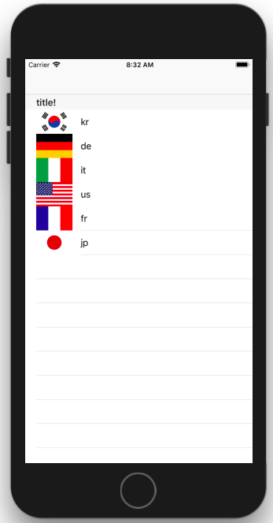
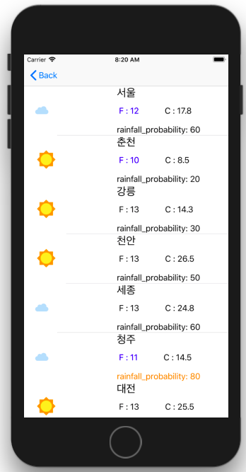

# World Weather 

- Read world weather information from Json file.

- Swift, Xcode, Tableview, TableViewcell, JSON

  

### 1. Main

- List of countries

### 2. List of cities' details 

- List of cities

### 3. a city details

